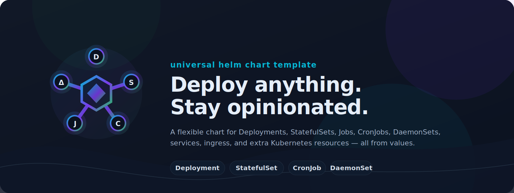

<p align="center">
  
</p>

<p align="center">
  <strong>A single, opinionated Helm chart for deploying any Kubernetes application workload.</strong><br>
  Instead of maintaining separate charts per application, define your entire deployment through values.
</p>

<p align="center">
  <a href="https://artifacthub.io/packages/search?repo=chartpack"></a>
  = 1.28">
  
  
</p>

## Features

- **Any workload type** -- [Deployment](https://kubernetes.io/docs/concepts/workloads/controllers/deployment/), [StatefulSet](https://kubernetes.io/docs/concepts/workloads/controllers/statefulset/), [DaemonSet](https://kubernetes.io/docs/concepts/workloads/controllers/daemonset/), [CronJob](https://kubernetes.io/docs/concepts/workloads/controllers/cron-jobs/), [Job](https://kubernetes.io/docs/concepts/workloads/controllers/job/)
- **Map-based configuration** -- every resource type uses named maps for consistency and multi-instance support
- **Unified container spec** -- containers, init containers, and sidecars share the same schema
- **Unified env** -- single `env` list handles literals, refs, bulk injection, chart-managed and external resources
- **Unified mounts** -- single `mounts` list for configMaps, secrets, persistence, and volumes
- **Auto-wiring** -- volumes and checksums auto-generated from container references
- **Multi-operator monitoring** -- Prometheus and VictoriaMetrics, ServiceMonitor and PodMonitor
- **Full RBAC** -- ServiceAccount, Roles, ClusterRoles, Bindings
- **Schema validation** -- `values.schema.json` catches errors at install time

## Requirements

- Kubernetes >= 1.28
- Helm >= 3.x

## Quick Start

```bash
helm install my-app ./chartpack -f values.yaml
```

Minimal `values.yaml`:

```yaml
containers:
  app:
    image:
      repository: nginx
      tag: "1.27"
    ports:
      http:
        port: 80

services:
  http:
    ports:
      http:
        port: 80
```

This produces a Deployment with 1 replica, a ClusterIP Service, and a ServiceAccount.

## Documentation

| Guide | Description |
|-------|-------------|
| [Workload Types](docs/workloads.md) | Deployment, StatefulSet, DaemonSet, CronJob, Job |
| [Containers](docs/containers.md) | Container spec, env, mounts, health checks, init containers |
| [Networking](docs/networking.md) | Services, ingresses, headless services |
| [Configuration](docs/configuration.md) | ConfigMaps, Secrets, External Secrets |
| [Storage](docs/storage.md) | Persistence, PVCs, StatefulSet volume claim templates |
| [Autoscaling & Availability](docs/autoscaling.md) | HPA, PDB |
| [RBAC](docs/rbac.md) | ServiceAccount, Roles, ClusterRoles, Bindings |
| [Monitoring](docs/monitoring.md) | Prometheus and VictoriaMetrics monitors |
| [Scheduling](docs/scheduling.md) | Node settings, affinity, tolerations, topology spread |
| [Advanced](docs/advanced.md) | Extra resources, global settings, pod settings |

## Values Reference

See the fully commented [`values.yaml`](values.yaml) for all available options.

## Examples

See the [`ci/`](ci/) directory for tested example configurations:

| File | Scenario |
|------|----------|
| [`minimal-values.yaml`](ci/minimal-values.yaml) | Simplest possible deployment |
| [`deployment-values.yaml`](ci/deployment-values.yaml) | Deployment with ingress, HPA, monitoring |
| [`statefulset-values.yaml`](ci/statefulset-values.yaml) | StatefulSet with persistence |
| [`cronjob-values.yaml`](ci/cronjob-values.yaml) | Scheduled batch job |
| [`full-values.yaml`](ci/full-values.yaml) | Every feature exercised |

## License

Apache License 2.0 -- see [LICENSE](LICENSE).
