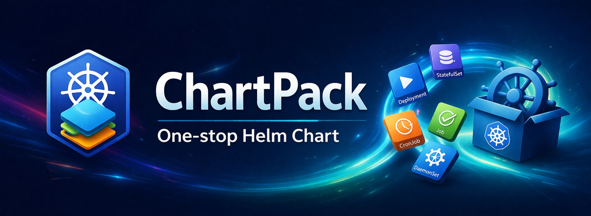

<p align="center">
  
</p>


<p align="center">
  <a href="https://artifacthub.io/packages/search?repo=chartpack"></a>
  <a href="https://github.com/cotzo/universal-helm/actions/workflows/lint.yaml"></a>
  <a href="https://github.com/cotzo/universal-helm/actions/workflows/integration.yaml"></a>
  = 1.28">
  
  
</p>

# Chartpack

A single, opinionated Helm chart for deploying any Kubernetes application workload.
Instead of maintaining separate charts per application, define your entire deployment through values

## Features

### Workloads
Deploy any Kubernetes workload type from a single chart: [Deployment](https://kubernetes.io/docs/concepts/workloads/controllers/deployment/), [StatefulSet](https://kubernetes.io/docs/concepts/workloads/controllers/statefulset/), [DaemonSet](https://kubernetes.io/docs/concepts/workloads/controllers/daemonset/), [CronJob](https://kubernetes.io/docs/concepts/workloads/controllers/cron-jobs/), [Job](https://kubernetes.io/docs/concepts/workloads/controllers/job/), and [Argo Rollout](https://argoproj.github.io/rollouts/) with canary/blue-green strategies. StatefulSets get automatic headless services and volume claim templates.

### Networking
Multiple [Services](https://kubernetes.io/docs/concepts/services-networking/service/) per release (ClusterIP, NodePort, LoadBalancer, headless), multiple [Ingresses](https://kubernetes.io/docs/concepts/services-networking/ingress/) with different controllers and TLS configs, and [Gateway API](https://gateway-api.sigs.k8s.io/) routes (HTTPRoute, GRPCRoute, TLSRoute, TCPRoute, UDPRoute) with traffic splitting, header matching, and timeouts. [Envoy Gateway](https://gateway.envoyproxy.io/) BackendTrafficPolicy support for rate limiting, circuit breaking, retries, and load balancing. [Istio](https://istio.io/) VirtualService, DestinationRule, PeerAuthentication, and AuthorizationPolicy with service name autowiring. Service ports reference container ports by name for type-safe wiring.

### Configuration & Secrets
Manage [ConfigMaps](https://kubernetes.io/docs/concepts/configuration/configmap/), [Secrets](https://kubernetes.io/docs/concepts/configuration/secret/) (Opaque, TLS, Docker registry), and [External Secrets](https://external-secrets.io/) (AWS Secrets Manager, Vault, etc.). Auto-generate random secrets via [ESO Password generators](https://external-secrets.io/latest/api/generator/password/) — ArgoCD-safe, no `helm lookup` needed. Auto-rollout on config changes via checksum annotations.

### Persistence
[Persistent volumes](https://kubernetes.io/docs/concepts/storage/persistent-volumes/) with automatic PVC creation for Deployments and volumeClaimTemplate generation for StatefulSets. Supports existing claims, storage classes, and access modes.

### Autoscaling & Availability
[HPA v2](https://kubernetes.io/docs/tasks/run-application/horizontal-pod-autoscale/) with CPU, memory, and custom metrics. [KEDA](https://keda.sh/) event-driven autoscaling with ScaledObjects (Deployments) and ScaledJobs (Jobs) — supports any KEDA trigger (SQS, Kafka, Prometheus, etc.). [Pod Disruption Budgets](https://kubernetes.io/docs/tasks/run-application/configure-pdb/) for safe rollouts and node maintenance.

### Monitoring
[Prometheus Operator](https://prometheus-operator.dev/) and [VictoriaMetrics Operator](https://docs.victoriametrics.com/operator/) support. Create multiple ServiceMonitors, PodMonitors, VMServiceScrapes, and VMPodScrapes from a single `monitors` map.

### Alerting
[PrometheusRule](https://prometheus-operator.dev/docs/developer/alerting/) and [VMRule](https://docs.victoriametrics.com/operator/resources/vmrule/) alerting/recording rules from the `alerting` map. Same operator switch pattern as monitoring — set `operator: prometheus` or `operator: victoriametrics` per rule set. Groups use standard PromQL syntax.

### Dashboards
[Grafana Operator](https://grafana-operator.github.io/grafana-operator/) GrafanaDashboard resources from the `dashboards.grafana` map. Supports inline JSON, grafana.com references, URL-sourced dashboards, ConfigMap references, and Jsonnet.

### OAuth2 Proxy
Declarative [oauth2-proxy](https://oauth2-proxy.github.io/oauth2-proxy/) integration. Define proxies with their provider settings, then reference them on any ingress or route. The chart auto-creates the proxy infrastructure and rewires traffic. Supports sidecar mode (native K8s 1.33+ sidecar in the app pod) or deployment mode (separate pods). Upstream URL auto-derived from your service configuration.

### RBAC
Full [RBAC](https://kubernetes.io/docs/reference/access-authn-authz/rbac/) support: ServiceAccount with IAM annotations (EKS, GKE), Roles, ClusterRoles, and Bindings with automatic name resolution.

### Scheduling
[Node affinity](https://kubernetes.io/docs/concepts/scheduling-eviction/assign-pod-node/#node-affinity) with simple OS/architecture targeting, [tolerations](https://kubernetes.io/docs/concepts/scheduling-eviction/taint-and-toleration/), [topology spread constraints](https://kubernetes.io/docs/concepts/scheduling-eviction/topology-spread-constraints/), and priority classes.

### Validation
Schema validation catches misconfigurations at install time. Cross-resource validation ensures mounts reference existing ConfigMaps, env vars reference existing Secrets, service ports match container ports, and role bindings point to real roles.

## Requirements

- Kubernetes >= 1.28
- Helm >= 3.x

### Optional CRDs / Operators

These are only required if you enable the corresponding feature in your values. The core chart (Deployment, Service, Ingress, ConfigMap, Secret, HPA, PDB, RBAC) has zero external dependencies.

| Feature | Operator / CRD | Values key | Minimum version |
|---------|----------------|------------|-----------------|
| Argo Rollouts | [Argo Rollouts](https://argoproj.github.io/rollouts/) | `workloadType: Rollout` | v1.6+ |
| Gateway API routes | [Gateway API CRDs](https://gateway-api.sigs.k8s.io/) | `networking.gatewayApi.routes` | v1.2+ |
| Envoy traffic policies | [Envoy Gateway](https://gateway.envoyproxy.io/) | `networking.gatewayApi.routes.*.policies.envoy` | v1.0+ |
| KEDA autoscaling | [KEDA](https://keda.sh/) | `autoscaling.keda.enabled: true` | v2.12+ |
| External secrets | [External Secrets Operator](https://external-secrets.io/) | `config.externalSecrets` | v0.9+ / v2.0+ |
| Generated secrets | [External Secrets Operator](https://external-secrets.io/) (Password generator) | `config.secrets.*.generate` | v0.9+ / v2.0+ |
| Prometheus monitoring | [Prometheus Operator](https://prometheus-operator.dev/) | `monitors` (operator: prometheus) | v0.70+ |
| Prometheus alerting | [Prometheus Operator](https://prometheus-operator.dev/) | `alerting` (operator: prometheus) | v0.70+ |
| VictoriaMetrics monitoring | [VictoriaMetrics Operator](https://docs.victoriametrics.com/operator/) | `monitors` (operator: victoriametrics) | v0.44+ |
| VictoriaMetrics alerting | [VictoriaMetrics Operator](https://docs.victoriametrics.com/operator/) | `alerting` (operator: victoriametrics) | v0.44+ |
| Grafana dashboards | [Grafana Operator](https://grafana-operator.github.io/grafana-operator/) | `dashboards.grafana` | v5.22+ |
| Istio service mesh | [Istio](https://istio.io/) | `networking.istio.*` | v1.20+ |

## Quick Start

```bash
helm install my-app ./chartpack -f values.yaml
```

Minimal `values.yaml`:

```yaml
containers:
  app:
    image:
      repository: nginx
      tag: "1.27"
    ports:
      http:
        port: 80

networking:
  services:
    http:
      ports:
        http:
          port: 80
```

This produces a Deployment with 1 replica, a ClusterIP Service, and a ServiceAccount.

## Documentation

| Guide | Description |
|-------|-------------|
| [Workload Types](docs/workloads.md) | Deployment, StatefulSet, DaemonSet, CronJob, Job, Argo Rollout |
| [Containers](docs/containers.md) | Container spec, env, mounts, health checks, init containers |
| [Networking](docs/networking.md) | Services, ingresses, headless services |
| [Gateway API Routes](docs/routes.md) | HTTPRoute, GRPCRoute, TLSRoute, TCPRoute, UDPRoute, Envoy policies |
| [Istio](docs/istio.md) | VirtualService, DestinationRule, PeerAuthentication, AuthorizationPolicy |
| [OAuth2 Proxy](docs/oauth2-proxy.md) | Automatic oauth2-proxy integration for ingresses and routes |
| [Configuration](docs/configuration.md) | ConfigMaps, Secrets, External Secrets, generated secrets |
| [Persistence](docs/persistence.md) | PVCs, StatefulSet volume claim templates |
| [Autoscaling & Availability](docs/autoscaling.md) | HPA, KEDA (ScaledObject, ScaledJob), PDB |
| [RBAC](docs/rbac.md) | ServiceAccount, Roles, ClusterRoles, Bindings |
| [Monitoring](docs/monitoring.md) | Prometheus and VictoriaMetrics monitors |
| [Alerting](docs/alerting.md) | PrometheusRule and VMRule alerting/recording rules |
| [Dashboards](docs/dashboards.md) | Grafana Operator dashboards (inline JSON, grafana.com, URL) |
| [Scheduling](docs/scheduling.md) | Node settings, affinity, tolerations, topology spread |
| [Advanced](docs/advanced.md) | Extra resources, global settings, pod settings |

## Values Reference

See the fully commented [`values.yaml`](values.yaml) for all available options.

## Examples

See the [`ci/`](ci/) directory for tested example configurations:

| File | Scenario |
|------|----------|
| [`minimal-values.yaml`](ci/minimal-values.yaml) | Simplest possible deployment |
| [`deployment-values.yaml`](ci/deployment-values.yaml) | Deployment with ingress, HPA, monitoring |
| [`statefulset-values.yaml`](ci/statefulset-values.yaml) | StatefulSet with persistence |
| [`daemonset-values.yaml`](ci/daemonset-values.yaml) | DaemonSet with pod monitoring |
| [`cronjob-values.yaml`](ci/cronjob-values.yaml) | Scheduled batch job |
| [`job-values.yaml`](ci/job-values.yaml) | One-shot job |
| [`rollout-values.yaml`](ci/rollout-values.yaml) | Argo Rollout with canary strategy |
| [`keda-values.yaml`](ci/keda-values.yaml) | KEDA ScaledObject with Deployment |
| [`scaledjob-values.yaml`](ci/scaledjob-values.yaml) | KEDA ScaledJob with SQS trigger |
| [`full-values.yaml`](ci/full-values.yaml) | Every feature exercised |

## License

Apache License 2.0 -- see [LICENSE](LICENSE).

